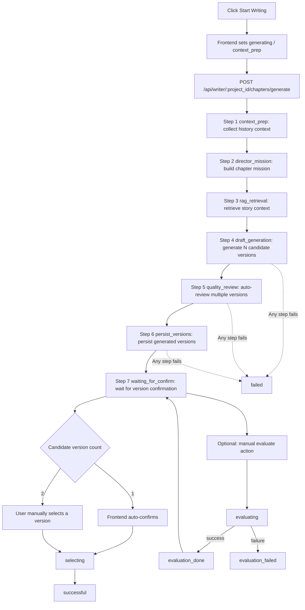

# MoFeng (墨风)

> An end-to-end AI novel creation platform, from first idea to final draft.  
> Make creative workflows visible, controllable, and continuously improvable.

[中文](./README.md) | English

---

## Product Positioning

MoFeng is designed for long-form fiction writers and small creative teams, covering the full pipeline:
idea generation, blueprint confirmation, chapter production, review/version selection, and administration.

It is not just a "writing helper". It is a production-ready writing workflow system:

- Supports both content creation and creative asset management
- Supports both local startup and Docker deployment
- Focuses on both writing quality and production efficiency

---

## Core Capabilities

### 1) Idea Incubation and Project Kickoff

- Rapidly converge on genre, main arc, style, and audience through multi-turn conversations
- Turn scattered ideas into an actionable project baseline
- Move directly from Inspiration Mode to blueprint and writing workflows without context loss

### 2) Blueprint-Driven Story System

- Organize worldbuilding, characters, factions, relationships, locations, and chapter missions in a structured blueprint
- Support blueprint generation, confirmation, editing, and continuous maintenance for long-form stability
- Reuse blueprint context in generation and review to reduce narrative drift

### 3) Industrialized Chapter Production

- Writing Desk supports generation, review, version comparison, selection, and second-pass editing
- Combine chapter outlines and project materials for context-aware drafting
- Upgrade from one-shot generation to a controllable loop: generate -> compare -> iterate -> finalize

### 4) Quality Guardrails and Consistency Control

- Provide six-dimension review, consistency checks, and auto-fix suggestions
- Track foreshadowing and state transitions to reduce long-arc continuity breaks
- Offer emotion-curve analytics to optimize pacing and reader experience

### 5) Memory and Knowledge Enhancement

- Inject project history into generation via memory layers and RAG retrieval
- Feed chapter summaries, character states, and key events back into future writing
- Keep earlier narrative assets continuously useful for later chapters

### 6) Admin and Operational Governance

- Built-in management for users, prompts, update logs, and system configuration
- Support ongoing tuning of writing strategy, prompts, and runtime parameters
- Fit solo creators, small teams, and private/self-hosted long-term operation

---

## What You Get

- **Faster project starts**: convert vague ideas into actionable story foundations
- **More stable long-form storytelling**: blueprint + memory + RAG + consistency checks working together
- **Higher first-draft usability**: chapters are not one-shot outputs but reviewable and iterable assets
- **Lower rewrite cost**: foreshadowing tracking, summary feedback, and character-state continuity reduce patchwork edits
- **Stronger collaboration**: unify creative assets, prompt strategy, and admin controls in one workspace

---

## Typical Use Cases

### Use Case 1: Launch a New Novel from Scratch

- Explore genre and main plot direction in Inspiration Mode
- Generate and confirm a structured blueprint
- Produce the first batch of usable chapter drafts quickly

### Use Case 2: Stabilize Quality in Mid/Late Serialization

- Use chapter review + consistency checks to identify structural issues
- Calibrate pacing with foreshadowing tracking and emotion curves
- Select stronger versions through side-by-side comparison before finalization

### Use Case 3: Team-Based Creation and Operations

- Centrally manage prompts, users, and system parameters
- Accumulate operational writing standards through update logs and config policies
- Run content production and quality governance in the same platform

---

## Product Interface Overview

- `InspirationMode`: idea co-creation and project kickoff
- `NovelWorkspace`: project list and progress management
- `NovelDetail`: aggregated settings, characters, outlines, chapters, and analytics
- `WritingDesk`: generation, review, version selection, and chapter editing workbench
- `AdminView`: users, prompts, statistics, and system configuration management

---

## Creation Workflow

1. Sign in or register  
2. Configure personal LLM and embedding models  
3. Start multi-turn concept conversations in Inspiration Mode  
4. Generate and confirm a structured blueprint  
5. Manage projects in Workspace  
6. Review project assets and analytics in Detail  
7. Generate, review, select, and edit chapter versions in Writing Desk  
8. Govern users, prompts, and system settings in Admin

### Writing Desk Chapter Generation Flow



Notes:
- `N` comes from config `writer.chapter_versions`, constrained to `1~2`.
- When `N=2`, reaching `waiting_for_confirm` means both versions are already generated and persisted.
- Current word-count control enforces over-limit compression, not under-limit auto-expansion.

---

## Technology Stack

- Frontend: Vue 3 + Vite + TypeScript + TanStack Query for Vue + Pinia + Vue Router + Naive UI
- Backend: FastAPI + SQLAlchemy + Pydantic Settings
- Storage: SQLite / MySQL + libsql vector retrieval
- AI: OpenAI-compatible LLM APIs, OpenAI/Ollama embeddings

### Frontend State Model

- TanStack Query handles server state: requests, caching, refresh, retry, loading/error
- Pinia keeps client state: auth token, current user, temporary inspiration-session state
- Global Query strategy: `frontend/src/lib/queryClient.ts`
- Business Query composables: `frontend/src/queries/`

---

## Quick Start

### Option A: One-Command Bootstrap (Recommended)

Run from repository root:

- Windows CMD: `dev.bat`
- PowerShell: `powershell -ExecutionPolicy Bypass -File .\dev.ps1`
- Bash: `bash ./dev.sh`

The launcher script will:

- Auto-install frontend dependencies (if `frontend/node_modules` is missing)
- Auto-create backend virtual environment (if `backend/.venv` is missing)
- Auto-install `uvicorn` and backend requirements when needed
- Auto-switch to available ports if default ports are occupied
- Print actual access URLs and effective API proxy target

### Option B: Manual Startup

Backend:

```bash
cd backend
python -m venv .venv
# Windows
.venv\Scripts\activate
# macOS / Linux
# source .venv/bin/activate

pip install -r requirements.txt
# Windows
copy env.example .env
# macOS / Linux
# cp env.example .env

uvicorn app.main:app --reload
```

Frontend:

```bash
cd frontend
npm install
npm run dev
```

Default URLs:

- Frontend: `http://127.0.0.1:6100`
- API: `http://127.0.0.1:6101`
- Swagger: `http://127.0.0.1:6101/docs`

---

## Docker Local Deployment

```bash
# Windows
copy deploy\.env.example deploy\.env
# macOS / Linux
# cp deploy/.env.example deploy/.env

docker compose --env-file deploy/.env -f deploy/docker-compose.yml up -d --build
```

Default URL: `http://127.0.0.1:6100`

To enable bundled MySQL profile:

```bash
docker compose --env-file deploy/.env -f deploy/docker-compose.yml --profile mysql up -d --build
```

---

## Configuration

For local development: use `backend/env.example` as the template for `backend/.env`.  
For Docker deployment: use `deploy/.env.example` as the template for `deploy/.env`.

Minimum required settings:

- `SECRET_KEY`
- `DB_PROVIDER`
- `SQLITE_DB_PATH` (when `DB_PROVIDER=sqlite`)

Recommended settings for full writing capabilities:

- `OPENAI_API_KEY`
- `OPENAI_API_BASE_URL`
- `OPENAI_MODEL_NAME`
- `EMBEDDING_PROVIDER`
- `EMBEDDING_MODEL`
- `VECTOR_DB_URL`
- `ADMIN_DEFAULT_USERNAME`
- `ADMIN_DEFAULT_PASSWORD`

---

## First-Run Auto Initialization

On first backend startup, the application will automatically:

1. Ensure the database exists
2. Create missing tables
3. Backfill missing legacy fields
4. Create the default admin account if none exists
5. Import `backend/prompts/*.md` into the database if missing
6. Sync default system configuration

---

## Project structure

```text
.
├─ backend/                  # FastAPI backend
│  ├─ app/
│  │  ├─ api/                # Routers
│  │  ├─ core/               # Config, security, dependencies
│  │  ├─ db/                 # DB setup and initialization
│  │  ├─ models/             # ORM models
│  │  ├─ repositories/       # Data access layer
│  │  ├─ schemas/            # Pydantic schemas
│  │  └─ services/           # Business services
│  ├─ prompts/               # Default prompt templates
│  └─ env.example
├─ frontend/                 # Vue frontend
│  ├─ src/
│  │  ├─ api/                # API clients and types
│  │  ├─ components/
│  │  ├─ lib/                # Frontend infrastructure such as Query Client
│  │  ├─ queries/            # TanStack Query composables
│  │  ├─ router/
│  │  ├─ stores/             # Pinia client state
│  │  └─ views/
├─ deploy/                   # Docker, Nginx, Compose
├─ docs/                     # Supplementary docs
├─ dev.bat
├─ dev.ps1
└─ dev.sh
```

---

## License

Please refer to the actual `LICENSE` file or your project distribution policy.
