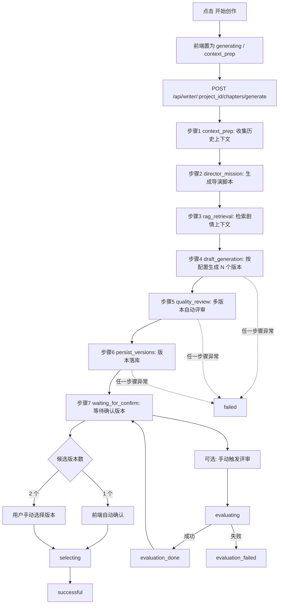

# MoFeng（墨风）

> 从灵感到成稿的一体化 AI 小说创作平台。  
> 让创作流程可视、可控、可迭代。

中文 | [English](./README-en.md)

---

## 产品定位

MoFeng（墨风）面向长篇小说创作者与小型创作团队，提供“创意生成 - 蓝图确认 - 章节生产 - 评审选版 - 后台治理”的全链路能力。

它不是单点的“写作助手”，而是可落地的写作工作流系统：

- 既能辅助创作，也能管理创作资产
- 既支持本地启动，也支持docker部署
- 既关注内容质量，也关注生产效率

---

## 核心能力

### 1) 灵感孵化与项目立项

- 通过多轮对话快速完成“题材 - 主线 - 风格 - 受众”的创意收敛
- 将零散灵感沉淀为可执行的项目起点，降低开篇难度
- 从灵感模式可直接衔接后续蓝图与写作流程，避免工具割裂

### 2) 蓝图化创作系统

- 以结构化蓝图组织世界观、角色、势力、关系、地点与章节任务
- 支持蓝图生成、确认、编辑与持续维护，保持中长篇创作的方向稳定
- 蓝图会参与后续生成与评审上下文，减少“写着写着跑偏”

### 3) 章节工业化生产

- 写作台支持章节生成、评审、版本对比、选版与二次编辑
- 结合章节大纲与项目资料进行上下文化生成，提高可用初稿比例
- 从“生成一次就结束”升级为“生成 - 对比 - 迭代 - 定稿”的可控流程

### 4) 质量护栏与一致性控制

- 提供六维审查、剧情一致性检查与自动修复建议
- 提供伏笔追踪与状态同步，降低长线叙事中的遗漏与断链风险
- 提供情绪曲线与分析视图，辅助节奏校准与读者体验优化

### 5) 记忆与知识增强

- 通过记忆层与检索增强（RAG）为生成阶段注入项目历史上下文
- 支持章节摘要、角色状态、关键事件等信息回流，减少上下文丢失
- 让“前文资产”持续服务“后文创作”，提升长篇连续性

### 6) 管理后台与运营能力

- 内置用户、Prompt、更新日志、系统配置管理
- 支持创作策略、提示词与系统参数的持续调优
- 适合个人创作者、小团队到私有化部署场景的长期运维

---

## 你会得到什么

- **更快开篇**：把“灵感很散”转成可执行的创作起点
- **更稳中长篇**：蓝图、记忆、RAG 与一致性检查协同，降低世界观漂移
- **更高可用初稿率**：章节生成不是一次性输出，而是可评审、可选版、可迭代
- **更低返工成本**：伏笔追踪、摘要回流、角色状态维护，让后续章节少“打补丁”
- **更强团队协作性**：创作资产、提示词与后台配置统一管理

---

## 典型使用场景

### 场景 1：从 0 到 1 启动一本新书

- 在灵感模式里完成题材和主线探索
- 生成并确认结构化蓝图
- 快速得到首批章节可用草稿

### 场景 2：连载中后期稳住质量

- 用章节评审 + 一致性检查识别结构性问题
- 结合伏笔追踪和情绪曲线做节奏校准
- 通过版本对比选择更优表达，再进入定稿

### 场景 3：团队化创作与运营

- 管理员统一管理 Prompt、用户和系统参数
- 通过更新日志与配置策略沉淀创作规范
- 在同一平台中实现“内容生产 + 质量治理”

---

## 产品界面总览

- `InspirationMode`：灵感共创与项目立项
- `NovelWorkspace`：项目列表与进度管理
- `NovelDetail`：设定、角色、纲要、章节、分析聚合页
- `WritingDesk`：章节生成、评审、选版、编辑工作台
- `AdminView`：用户、Prompt、统计、系统配置管理

---

## 创作流程

1. 登录或注册  
2. 配置个人 LLM / Embedding 模型  
3. 在灵感模式中发起多轮概念对话  
4. 生成并确认结构化蓝图  
5. 在工作区管理项目  
6. 在详情页查看创作资产与分析结果  
7. 在写作台生成、评审、选版、编辑章节  
8. 在后台完成用户、Prompt、配置治理

### 写作台章节生成阶段流程图



说明：
- `N` 由配置决定，范围 `1~2`（`writer.chapter_versions`）。
- 当 `N=2` 时，进入 `waiting_for_confirm` 即表示两个版本都已生成并写入。
- 字数约束目前是“超上限压缩”，不是“低字数自动补全”。

---

## 技术架构

- 前端：Vue 3 + Vite + TypeScript + TanStack Query for Vue + Pinia + Vue Router + Naive UI
- 后端：FastAPI + SQLAlchemy + Pydantic Settings + LangGraph（章节生成流水线状态机编排）
- 存储：SQLite / MySQL + libsql 向量检索 + Redis（缓存与后台任务 SSE 推送）
- AI：OpenAI 兼容接口 + OpenAI / Ollama Embedding
- 部署：Docker Compose 单容器，supervisord 托管 uvicorn + nginx 多进程；可选 MySQL / Redis profile

### 前端状态模型

- TanStack Query 负责服务端状态：请求、缓存、刷新、重试、loading/error
- Pinia 负责客户端状态：登录令牌、当前用户、灵感流程临时会话状态
- Query 全局策略：`frontend/src/lib/queryClient.ts`
- 业务 Query 组合函数：`frontend/src/queries/`

---

## 快速开始

### 方式 A：一键启动（推荐）

在仓库根目录执行：

- Windows CMD：`dev.bat`
- PowerShell：`powershell -ExecutionPolicy Bypass -File .\dev.ps1`
- Bash：`bash ./dev.sh`

脚本会自动处理以下事项：

- 自动安装前端依赖（若 `frontend/node_modules` 不存在）
- 自动创建后端虚拟环境（若 `backend/.venv` 不存在）
- 自动补装 `uvicorn` 及后端依赖
- 默认端口冲突时自动切换可用端口
- 输出实际可访问地址与 API 代理地址

### 方式 B：手动启动

后端：

```bash
cd backend
python -m venv .venv
# Windows
.venv\Scripts\activate
# macOS / Linux
# source .venv/bin/activate

pip install -r requirements.txt
# Windows
copy env.example .env
# macOS / Linux
# cp env.example .env

uvicorn app.main:app --reload
```

前端：

```bash
cd frontend
npm install
npm run dev
```

默认地址：

- 前端：`http://127.0.0.1:6100`
- API：`http://127.0.0.1:6101`
- Swagger：`http://127.0.0.1:6101/docs`

---

## Docker 本地部署

```bash
# Windows
copy deploy\.env.example deploy\.env
# macOS / Linux
# cp deploy/.env.example deploy/.env

docker compose --env-file deploy/.env -f deploy/docker-compose.yml up -d --build
```

默认访问地址：`http://127.0.0.1:6100`

如需启用内置 MySQL：

```bash
docker compose --env-file deploy/.env -f deploy/docker-compose.yml --profile mysql up -d --build
```

---

## 配置说明

本地开发：使用 `backend/env.example` 作为 `backend/.env` 模板。  
Docker 部署：使用 `deploy/.env.example` 作为 `deploy/.env` 模板。

最低可启动配置：

- `SECRET_KEY`
- `DB_PROVIDER`
- `SQLITE_DB_PATH`（当 `DB_PROVIDER=sqlite`）

建议补齐（确保创作能力完整可用）：

- `OPENAI_API_KEY`
- `OPENAI_API_BASE_URL`
- `OPENAI_MODEL_NAME`
- `EMBEDDING_PROVIDER`
- `EMBEDDING_MODEL`
- `VECTOR_DB_URL`
- `ADMIN_DEFAULT_USERNAME`
- `ADMIN_DEFAULT_PASSWORD`

---

## 首次启动自动初始化

后端首次启动会自动：

1. 确保数据库存在
2. 创建缺失表结构
3. 补齐历史缺失字段
4. 在无管理员时创建默认管理员账号
5. 将 `backend/prompts/*.md` 导入数据库
6. 同步默认系统配置

---

## 项目结构

```text
.
├─ backend/                  # FastAPI 后端
│  ├─ app/
│  │  ├─ api/                # 路由层
│  │  ├─ core/               # 配置、安全、依赖
│  │  ├─ db/                 # 数据库初始化与连接
│  │  ├─ models/             # ORM 模型
│  │  ├─ repositories/       # 数据访问层
│  │  ├─ schemas/            # Pydantic Schema
│  │  └─ services/           # 业务服务层
│  ├─ prompts/               # 默认 Prompt 模板
│  └─ env.example
├─ frontend/                 # Vue 前端
│  ├─ src/
│  │  ├─ api/                # API 客户端与类型
│  │  ├─ components/
│  │  ├─ lib/                # Query Client 等前端基础设施
│  │  ├─ queries/            # TanStack Query 组合函数
│  │  ├─ router/
│  │  ├─ stores/             # Pinia 客户端状态
│  │  └─ views/
├─ deploy/                   # Docker / Nginx / Compose
├─ docs/                     # 补充文档
├─ dev.bat
├─ dev.ps1
└─ dev.sh
```

---

## 许可

请以仓库中的实际 `LICENSE` 文件或你的发布策略为准。
